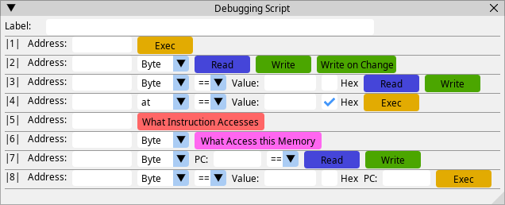

# PCSX-Redux Debugging Script


This Lua script enhances the debugging capabilities of the [PCSX-Redux](https://github.com/grumpycoders/pcsx-redux) Emulator, making it easier to create and manage conditional breakpoints.

It is heavy inspired from the debuggers of [no$psx](http://problemkaputt.de/psx.htm), [PCSX2](https://pcsx2.net), and [Cheat-Engine](https://www.cheatengine.org).


### Features
 - Breakpoints on read, write and write-change memory access
 - Breakpoints on Registers when meet certain conditions
 - Breakpoints on Memory values and conditions
 - Track when and how memory addresses are accessed


### Installation
1 - Download the script and place it in the PCSX-Redux directory

2 - Run PCSX-Redux and open Lua Console

3 - Type: ```loadfile('script-debug.lua')()```

4 - The Lua Console will display "Debugging Script is Loaded"


### Usage



 - **1st Row**: Breakpoint on a specific address

 - **2nd Row** (Memory Access): Breakpoint on a specific address is read, write or write-change

 - **3rd Row** (Conditional Memory Access): Breakpoint on an address when meets a specific value condition during read or write

 - **4th Row** (Register Breakpoint): Breakpoint at PC when a register meets a specific condition

 - **5th Row** (Memory Access Tracking): Show addresses accessed by a specific PC (similar to Cheat-Eninge "Find out what addresses this instruction accesses")

 - **6th Row** (Instruction Tracking): Show instructions that access a specific address (similar to Cheat-Engine "Find out what accesses this address")

 - **7th Row** (PC-Conditional Memory Access): Breakpoint on when a specific PC accesses a memory address under certain conditions during read or write

 - **8th Row** (Address-Conditional PC ): Breakpoint on a specific PC when a specific address meets value condition 


### Hotkeys
 - Double Left-Click on any Field to copy Value

 - Double Right-Click on any Field to paste Value

 - Single Left-Click on an Address-Button to copy Address
 
 - Single right-click on an Address-Button to jump to Memory / Assembly View


### Acknowledgments
 - Special thanks to [Nicolas Noble](https://www.github.com/nicolasnoble) and [Skitchin](https://github.com/johnbaumann) for helping with some aspects